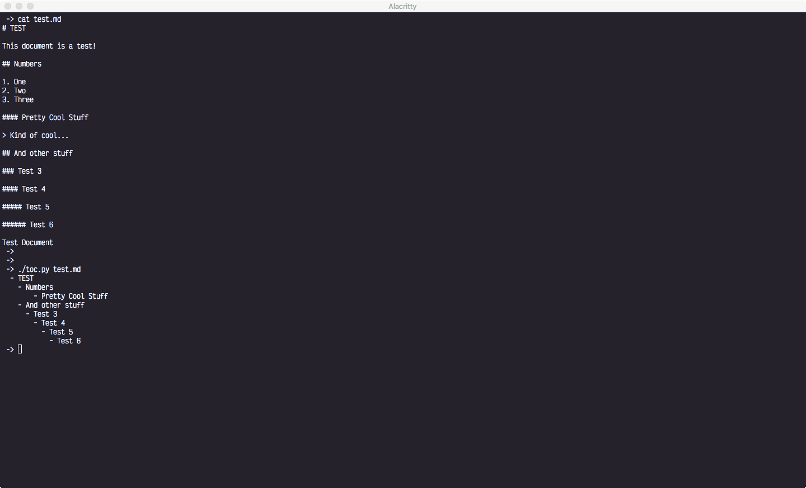

# Markdown Table of Contents

This utility will scan a markdown document and output a formatted hierarchical structure of headings.

## Uses

This project may be utilized in a few different ways:

1. Summary - By printing all headings of a document, a concise overview of the contents may be extrapolated
1. Document Overview - The table of contents created may be included in the document itself

## Example

